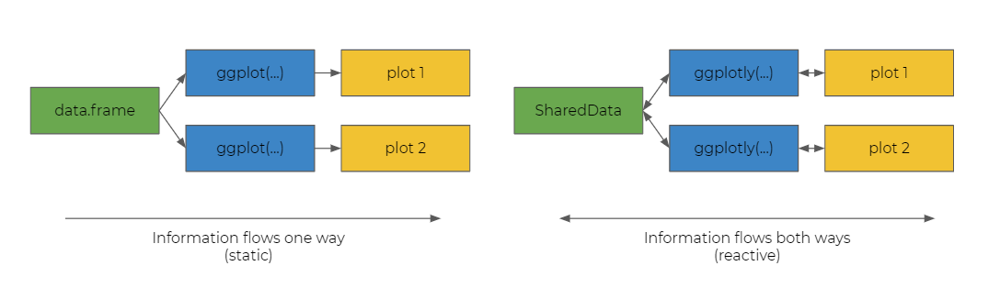
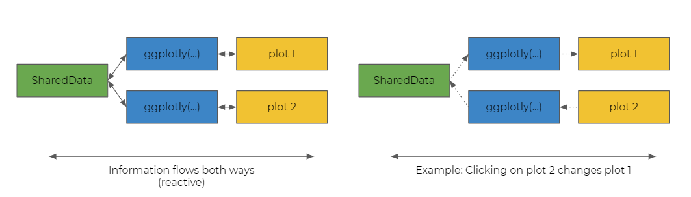
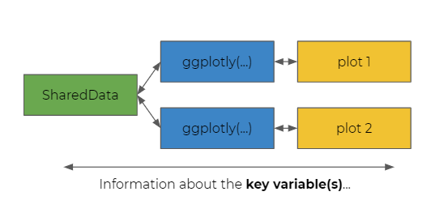
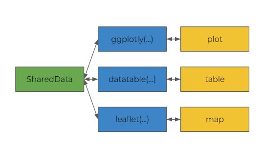
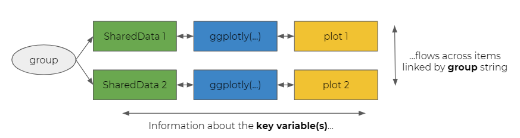

```{r setup, include=FALSE}
knitr::opts_chunk$set(echo = FALSE, warning = FALSE, message = FALSE, error = FALSE, out.width = "100%")
```

```{r pkg-load}
library(dplyr)
library(ggplot2)
library(plotly)
library(DT)
library(leaflet)
library(crosstalk)
library(checkdown)
```

```{r data-load}
trips <- 
  readRDS("data/trips_apr.rds") %>%
  select(station_name, station_id, year_2019, pct_change, prop_wend_2019) %>%
  mutate_at(vars(pct_change, prop_wend_2019), round, 2)
stations <- readRDS("data/stations.rds")
```

## Motivation

This tutorial will help you learn to use the `crosstalk` package to link different `htmlwidgets`. After completing this tutorial, you will be able to build an application like the one below, which visualizes the number of rides at a sample of Chicago train stations in 2019 versus 2020. 

Click and drag a subset of points on the scatterplot below to see how the map and table are dynamically filtered.

```{r full-example, out.width = "80%"}
# load libraries ----
library(ggplot2)
library(plotly)
library(DT)
library(leaflet)
library(crosstalk)

# create SharedData ----
trips_ct <- SharedData$new(trips, key = ~station_id, group = "loc")
trips_sub_ct <- SharedData$new(trips[,c("station_name", "station_id", "pct_change")], 
                               key = ~station_id, group = "loc")
stations_ct <- SharedData$new(stations, key = ~station_id, group = "loc")

# create individual widgets ----

# map
lf <- leaflet(stations_ct) %>% addTiles() %>% addMarkers()

# table
dt <- datatable(trips_sub_ct,
                fillContainer = TRUE,
                rownames = FALSE,
                colnames = c("Station", "ID", "% Change"),
                options = list(autowidth = TRUE))

# plot
gg <- ggplot(trips_ct) +
    aes(
      x = prop_wend_2019, 
      y = pct_change,
      col = pct_change,
      name = station_name) +
    geom_point() +
    guides(col = FALSE) +
  labs(
    x = "% Apr 2019 Trips on Weekend",
    y = "% Change Apr 2020 vs 2019"
  ) +
  scale_x_continuous(labels = scales::percent) +
  scale_y_continuous(labels = scales::percent)
gg_ly <- 
  ggplotly(gg, tooltip = "name") %>%
  highlight(on = "plotly_selected",
            off = "plotly_doubleclick")

# create final output ----
bscols(gg_ly, lf, dt, widths = c(6, 6, 12))
```

## Prerequisites

This tutorial assumes familiarity with the following packages:

- `ggplot2`
- `plotly`
- `DT`
- `leaflet` 

You don't need to be an expert of any of these packages to follow along. However, syntax related to those packages won't be explained in great detail.

## Introducing `SharedData`

`crosstalk` is powerful because it lets you create a `SharedData` object. 

Typical `data.frame`s (and `tibble`s, `data.table`s, etc.) are static. When we pass that data into a function like `ggplot()`, the flow of information is unidirectional. We take the data, make one or more plots, and all of those pieces are independent and agnostic to one another.

In contrast, `SharedData` allows you to create multiple downstream objects (like `ggplotly` objects) that can transmit information between them.

```{r}

```

Conceptually, this words because `ggplotly` and other JavaScript-based `htmlwidgets` can sense inputs such as button clicks and "react". This information can be sent back to the `SharedData` object and cause other objects that were derived from the `SharedData` object to react. In the example below, `plot 2` sends information back to `plot 1` via the `SharedData` object.

```{r}

```

## Creating a `SharedData` object

```{r}
knitr::opts_chunk$set(echo = TRUE, out.width = "60%")
```


To create a `SharedData` object, we must specify it's key. The key is one or more columns of our dataset for which we want to capture values and transmit to other objects.

```{r echo = FALSE}

```

For example, in the demo app, highlighting *stations* on the scatterplot filters stations in the map and table, so `station_id` would be the variable we would want in the key.

Once we pick our key, we can create a new `SharedData` object like this:

```
data_ct <- SharedData$new(data, key = {one or more column names give as right-hand side of formula})
```

For example, consider the `trips` dataset which contains one row per station with summary statistics on 2019 and 2020 rides. 

```{r}
head(trips)
```

We can make a `SharedData` object like this:

```{r}
trips_ct <- SharedData$new(trips, key = ~station_id)
```

Notice that `station_id` is preceded by a tilde (`~`) because key expects a *formula* not a *variable name* as input. 

## Using `SharedData` in plots

We can pass `SharedData` to `ggplot2::ggplot()` just like a normal dataframe.

```{r}
gg <- ggplot(trips_ct, aes(year_2019, pct_change)) + geom_point()
gg
```

And *like any other `ggplot`* (that is, the following does **not** require `crosstalk`), you may pass this `ggplot` object into `plotly::ggplotly()` to turn it into an `htmlwidget`. 

```{r}
ggplotly(gg)
```

## Ex: One dataset, two plots

Now that you know how to make a `SharedData` object with `crosstalk`, we can make our first application. The steps are:

1. Create a `SharedData` object
2. Make `htmlwidgets` with `SharedData` input
  + Here, we do this first by making `ggplot` objects...
  + ...and then converting them to `ggplotly` objects
3. Output results 

For step 3, I use the `crosstalk::bscols()` function to put the resulting interactive plots in a row (similar to `grid.arrange`.) However, you could also just output them one-at-a-time.

In the output below, click on a point on one plot and notice that the point related to the same station is highlighted in the other plot.

```{r}
# make SharedData object ----
trips_ct <- SharedData$new(trips, key = ~station_id)

# make ggplots using SharedData object ----
gg_year <-
  ggplot(trips_ct) +
  aes(x = year_2019, y = pct_change, col = pct_change) +
  geom_point()
  
gg_week <- 
  ggplot(trips_ct) +
  aes(x = prop_wend_2019, y = pct_change, col = pct_change) +
  geom_point()
  
# convert ggplots to ggplotly ----
gg_year_ly <- ggplotly(gg_year)
gg_week_ly <- ggplotly(gg_week)

# compose output ----
bscols(gg_year_ly, gg_week_ly)
```

## Quiz: `SharedData` key

Which one of the following demonstrates the correct way to create a `SharedData` object which should share information about the `station_id` column of the `trips` dataset?

- `trips_ct <- SharedData$new(trips, group = ~station_id)`
- `trips_ct <- SharedData$new(trips)`
- `trips_ct <- SharedData$new(trips, key = ~station_id)`
- `trips_ct <- SharedData$new(trips, key = 'station_id')`

Highlight the answer in white text: <span style="color: white;">Answer 3 is correct. The columns named should be passesd as a formula not a character, and to the "key" parameter not "group".</span>

## Beyond plots

`crosstalk` doesn't just work with plots! It works with selected other `htmlwidgets` also. Specifically, you may use a `SharedData` object with `DT` tables and `leaflet` maps. Just as with `ggplot()`, you simply pass your `SharedData` into functions from these packages just as you would a normal dataframe.

```{r echo = FALSE}

```

## Ex: One dataset, two widgets

In the following example, we will now make a plot interact with a table instead of another plot. Let's recall our key steps and then execute!

1. Create a `SharedData` object
2. Make `htmlwidgets` with `SharedData` input
  + Before this was two `ggplotly`s
  + Now, we have one `ggplotly` and one `datatable`
3. Output results 
  + We could use `bscols` again, but I didn't to show that it wasn't necessary

```{r}
# make SharedData object ----
trips_ct <- SharedData$new(trips, key = ~station_id)

# make ggplots using SharedData object ----
gg_year <-
  ggplot(trips_ct) +
  aes(x = year_2019, y = pct_change, col = pct_change) +
  geom_point()

# make htmlwidgets ----
gg_year_ly <- ggplotly(gg_year)
dt_stations <- datatable(trips_ct)

# compose output ----
gg_year_ly
dt_stations
```

## Multiple datasets

If you recall our original motivation, we also showed a map. To make this map, we need the latitude and longitude of each station. However, this isn't in our `trips` dataset. Instead, it is in the `stations` dataset shown below.

```{r}
head(stations)
```

Fortunately, we can link multiple `SharedData` objects together!

(In theory, we could also join `stations` and `trips` and use one dataset. We intentionally won't do that to motivate the next example.)

## Linking `SharedData` objects

To link multiple `SharedData` objects, we can specify a `group` argument when constructing the `SharedData` objects. `group` is a character string that servers as a unique identifier for a set of `SharedData` objects across whom the `key` information should be transmitted.

```{r echo = FALSE, out.width = "80%"}

```

We can create multiple, linked `SharedData` objects like this:

```
data1_ct <- SharedData$new(data, key = ~var1, group = "xyz")
data2_ct <- SharedData$new(data, key = ~var2, group = "xyz")
```

In the example above, the `data1_ct` and `data2_ct` will share information since they have the same value for `group`. The values for `var1` will be used to filter `var2` and vice versa.  

## Ex: Two datasets, two widgets

Now, let's practice. We follow the same recipe as before. Only now we create two `SharedData` objects.

1. Create a `SharedData` objects
2. Make `htmlwidgets` with `SharedData` input
3. Output results 

```{r}
# make SharedData object ----
trips_ct <- SharedData$new(trips, key = ~station_id, group = "group")
stations_ct <- SharedData$new(stations, key = ~station_id, group = "group")

# make ggplots with SharedData object ----
gg_year <-
  ggplot(trips_ct) +
  aes(x = year_2019, y = pct_change, col = pct_change) +
  geom_point()
  
# make htmlwidgets ----
gg_year_ly <- ggplotly(gg_year)
lf_station <- leaflet(stations_ct) %>% addTiles() %>% addMarkers()

# compose output ----
bscols(gg_year_ly, lf_station)
```

## Quiz: `SharedData` group

Consider the following code initializing `SharedData` objects. 

```
data1_ct <- SharedData$new(data1, key = ~x, group = "a")
data2_ct <- SharedData$new(data2, key = ~y, group = "a")
data3_ct <- SharedData$new(data1, key = ~x, group = "b")
```

Which two datasets wil be linked in the output? 

Highlight the answer in white text: <span style="color: white;">data1_ct and data2_ct because they share the same group.</span>

## Finale

Now, let's return to our motivational example. With what you've learned, you should now be able to understand all of the code required to reproduce it. Read through and think about how each part maps to the output and matches the steps we've been following: 

1. Create a `SharedData` objects
2. Make `htmlwidgets` with `SharedData` input
3. Output results 

```{r finale, ref.label = "full-example", eval = FALSE}
```

## Learn more!

To learn more about `crosstalk` and browser-based interactivity in R, check out package author Carson Sievert's book [**Interactive web-based data visualization with R, plotly, and shiny**](https://plotly-r.com/) from CRC Press!


